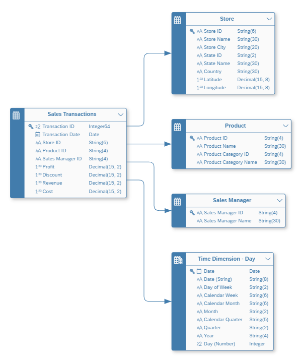

# Overview about the Business Scenario & the Data Model

## The Business Screnario

The sample data set for the session represents retail transactions from a number of outlet stores located in the United States. The transaction details include the store, the sold product, and the sales manager. In addition, the information on revenue, cost, discount, and profit is available for each transaction. 

The sales department is looking for a few analytics they need:

* **Top 10 Revenue Generating Products** 
They want to discover the top 10 revenue generating products in 2022.  

* **Sales Per Region** 
Due to an increase in the number of sales, the customer wants to understand how the different regions are  performing. Based on this visualization, the marketing team would identify the regions which are doing good as  well as the regions which need attention or better marketing campaigns  

* **Best Sales Representative** 
It is time for the company to reward the best Sales Representative for all the hard-work that has resulted in the  sales report. For this purpose, the company needs to have a visualization that shows revenue per sales  representative.  

The exercises will walk you through the steps using SAP Datasphere and SAP Analytics Cloud to answer those open questions, where the following tables are being used:  

| Table Name          | Description                           | Model Type          |
|:--------------------|:--------------------------------------|:--------------------|
| Sales Transactions  | Daily retail transactions per store   | Relational Dataset  |
| Store	              | Details per Store Outlet              | Dimension           | 
| Sales Manager       | Details on all Sales Manager          | Dimension           | 
| Product             | Details on the products being sold    | Dimension           | 

The data is provided in CSV files in this ZIP-file: :arrow_right: [DA160_Resources.zip](../../DA160_Resources.zip)

## The Data Model

These four tables consist of one fact table which includes the sales transactions details, and three dimension tables for more details about the product, the store and the sales manager.  
The ***Time Dimension*** will be created as part of the Exercise 02 and associated to the sales transaction table as shown in the Enitity-Relationship-Model.

 

## Summary

Now that you have a good understanding of the business scenario and the data model, you can start to get a guided experience trial system.

Continue with [Get your Guided Experience Trial system](../ex00/README_GuidedTrial.md)
