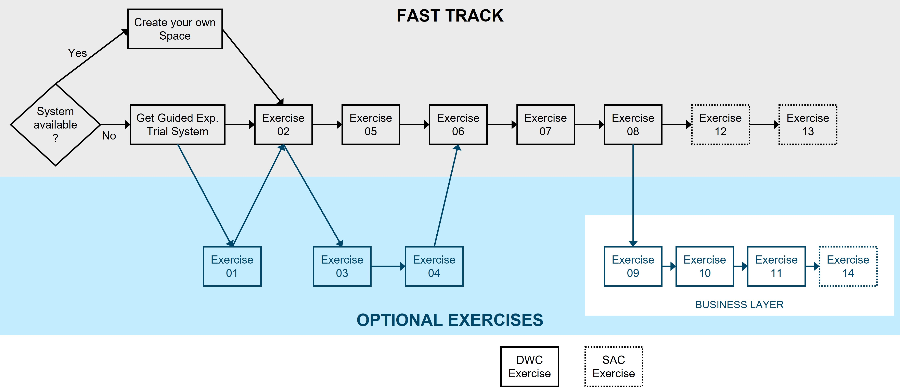

# Exercise Overview

We structured the overall exercise the following way:  
  * **Fast Track** for anyone eager to finish early and enjoy exploring the system on your own
  * **Optional Exercises** if you want to learn more about the solution especially how to create tables, ER Models, and Business Layer Models

 
    
### Let us give you a brief introduction on what can you expect in the different parts of the exercise.
  

## 1. **Getting Started**
   
   In this area you get an [overview about the business scenario & the data model](README.md) used throughout the exercises.
   
   We also give you guidance how to [get your guided experience trial system](README_GuidedTrial.md) in case you do not have access to a SAP Datasphere system already.
	
## 2. **SAP Datasphere**
   
   In this section you get an overview about your [first log on](../ex01/README.md) and how you navigate in the system in case you have never used SAP Datasphere before. 
   
   The first **mandatory** exercise in [#02: Get to know your own Space](../ex02/README.md) where you learn more about Spaces and create the ***Time Dimension*** required for your modeling in later parts of the exercise.
	  
## 3. **SAP Datasphere – Data Builder**

   This is the core part of the modeling exercise. You can [manually create the tables](../ex03/README.md) and the [entity relationship model](../ex04/README.md), or use the ***Fast Track*** by [importing the tables](../ex05/README.md) provided with the [CSN file](https://cap.cloud.sap/docs/cds/csn) called *Sales_ER_Model.json*.
   
   Then you populate the tables with data by [uploading data files](../ex06/README.md) using the CSV files from the ZIP file. Based on this tables you then [create a dimension view](../ex07/README.md) as well as an [analytical dataset](../ex08/README.md).
	
## 4. **SAP Datasphere – Business Layer**

   The exercises in the Business Layer are ***optional***.   However, if you are interested you will learn how to create a Business Layer [dimension](../ex09/README.md), a Business Layer [fact](../ex10/README.md), and a [consumption model](../ex11/README.md).
	
## 5. **SAP Analytics Cloud**

   In this part you will create simple stories in SAP Analytics Cloud to learn how to visualize your data based on a live connection to SAP Datasphere. The first story shows a [Top 10 Revenue Generating Products](../ex12/README.md) and the second the [Revenue by Geography](../ex13/README.md). Both require the previous exercises to be completed up to exercise 08. 
   
   The final story about the [Best Salesperson](../ex14/README.md) can only be completed if you finished the exercise 09 to 11.

## Summary

Now that you have a good understanding of the exercises, lets get started with the hands-on part.

Continue with [Exercise 01: First Log On](../ex01/README.md)
