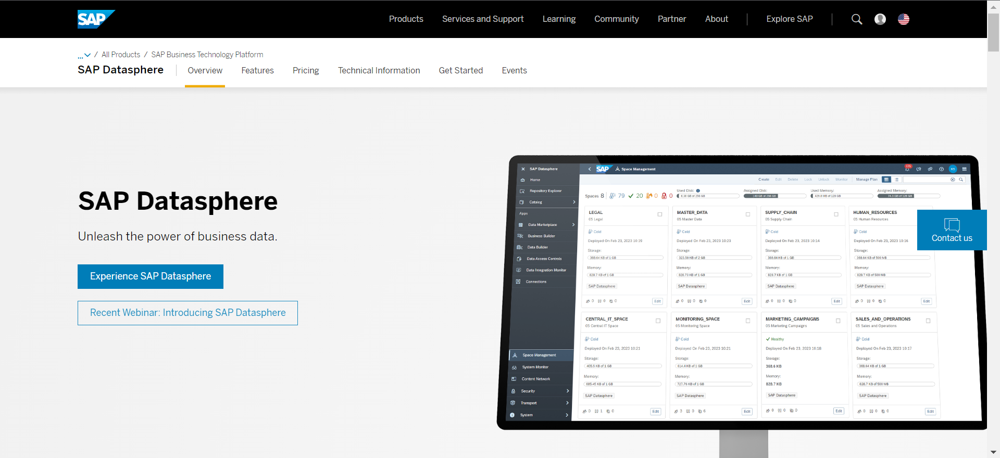
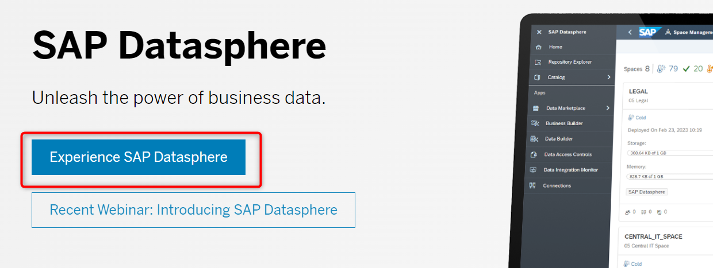
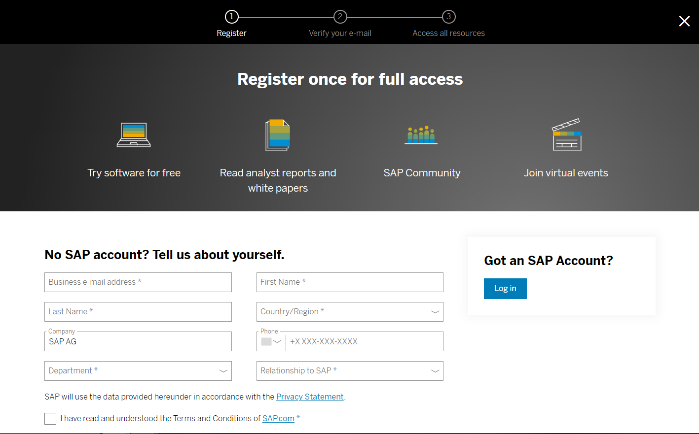
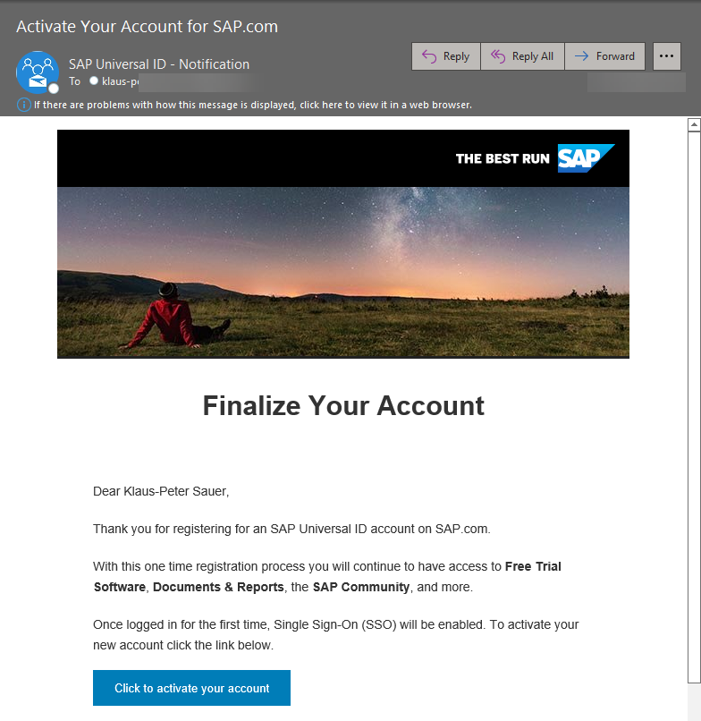
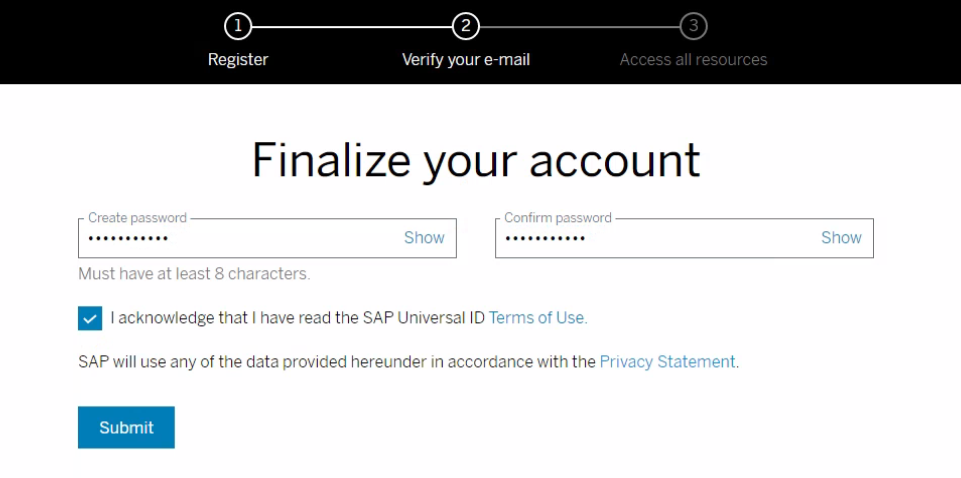
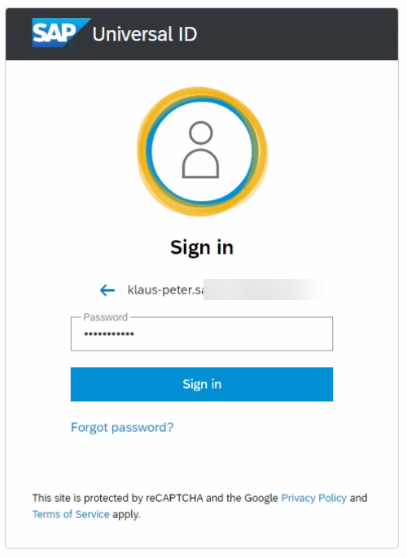
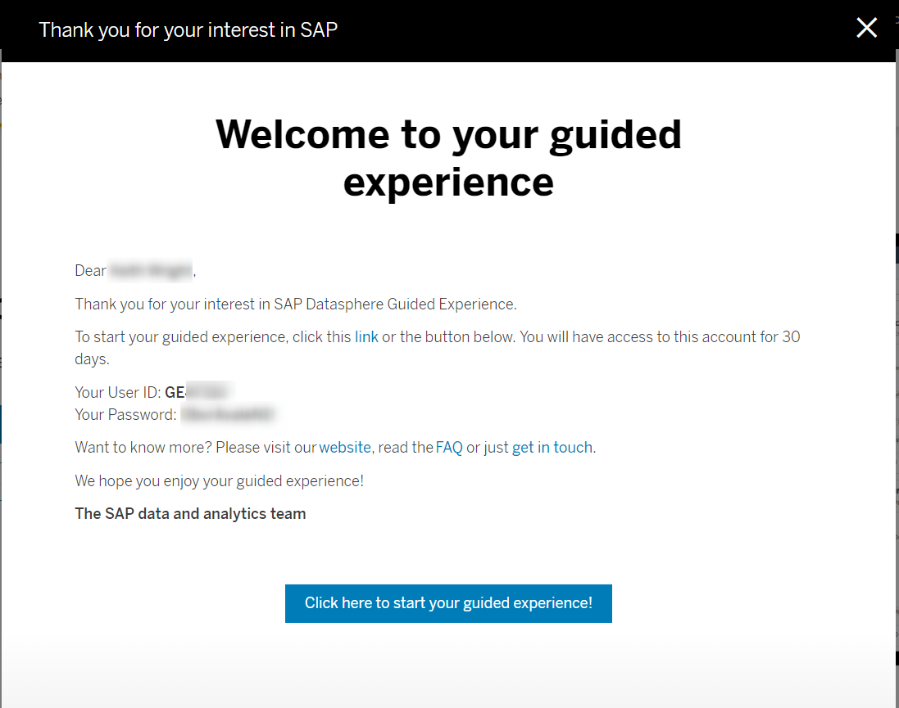
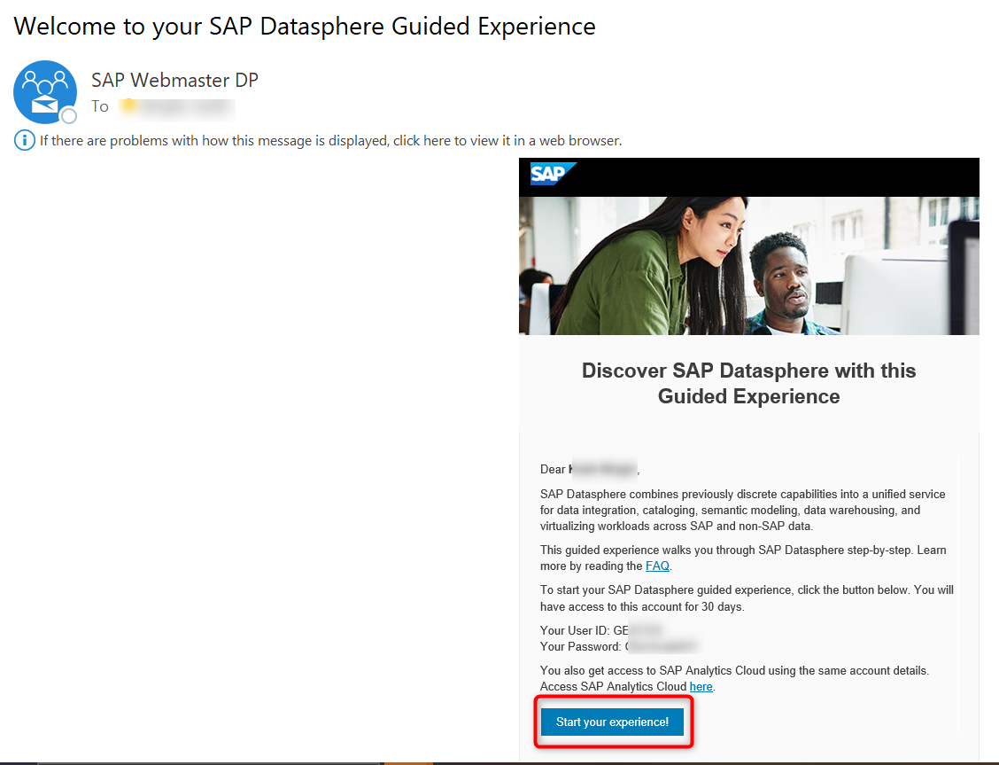
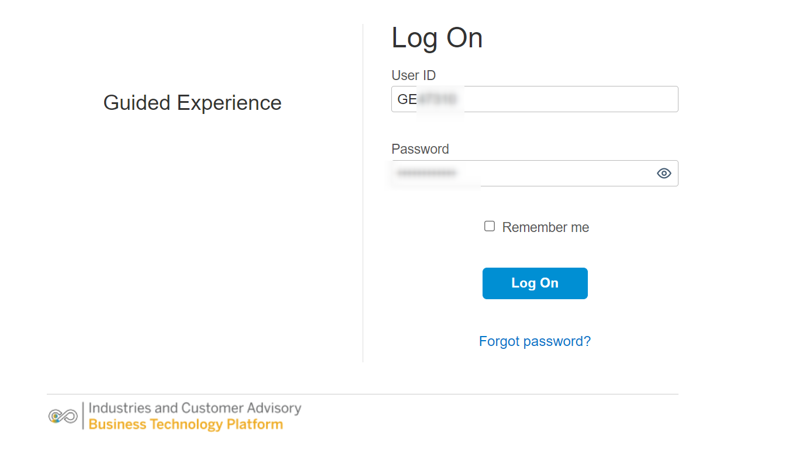
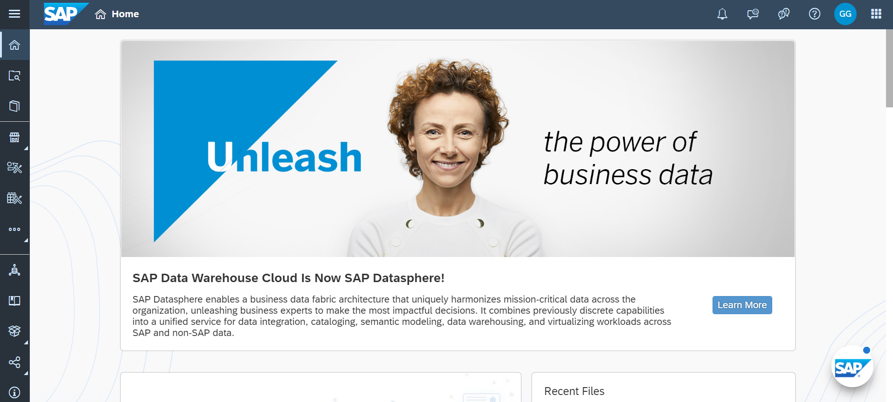

# Get your guided experience trial system 

First you need to get your guided experience trial system of SAP Datasphere (mandatory). You could use any SAP Datasphere system you have access to, as all the required files are provided a part of this GitHub repository. 

1.	Navigate to the SAP Datasphere product page on sap.com:   https://www.sap.com/products/technology-platform/datasphere.html
 

2.  Click on the ***Experience SAP Datasphere*** button or alternatively use the follwing link  
https://www.sap.com/registration/trial.4d48ec23-eadf-4399-8595-ac3f9c66c64f.html
 

3.  The registration form will show up. Please enter the mandatory details and proceed using the ***SUBMIT*** button.  

---

> :bulb: Tip: If you already have a SAP Universal ID then proceed using the LOG IN button in the right of the form. 

---

 

4.  You then get an email to finalize you account. Activate your account by clicking on the button ***CLICK TO ACTIVATE YOUR ACCOUNT***

 
  
  Enter a password and click ***SUBMIT***.
   
  
5.  In case you already have a universal ID, you are asked to provide your existing password.
 

6.  Now your login details (user ID and password) are shown to you. 

 

  You will also get an email with the same information

 

7.  You can login into your guided experience trial tenant using the login details and the URL you have received.

 

8.  After a successful login you get to the welcome screen.

 

## Summary

Now that you have a guided experience trial system available, lets get started with the hands-on exercises.

Continue with [Exercise 01: First Log On](../ex01/README.md)
