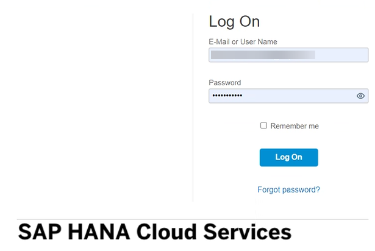
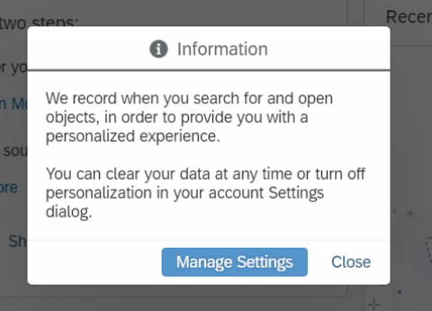
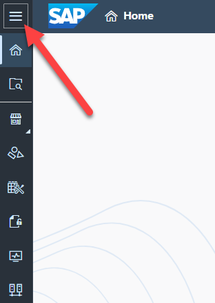
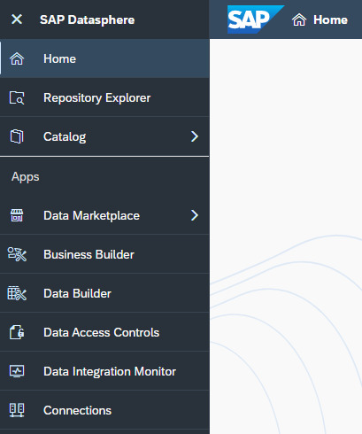
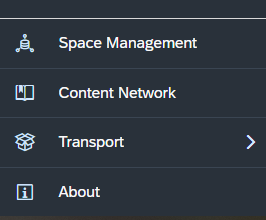
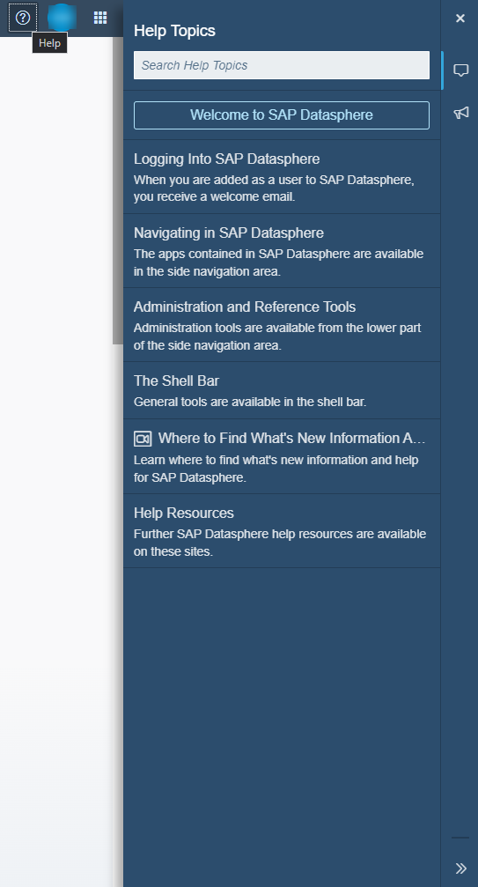

# Exercise 01: First Log On 

> :memo: **Note:** This is an Optional Exercise

---

1. Open Google Chrome and log on to your SA system.
 

2. In case you get the follwing pop-up message, use the ***CLOSE*** button to get to the start screen. 
 

3. In the top left of the start screen you will find the menu options.  
 

4. By clicking on the menu in the top left (the hamburger icon), you can expand the menu to also show the menu text.  
 

5. The bottom part of the menu shows the administrative functions.  
 

6. Now let’s clarify the different areas:  

| Menu Items:              | Description:                            |
|:-------------------------|:----------------------------------------|
| Repository Explorer      | Browse and create objects in repository |
| Data Marketplace         | Purchase data products from providers and download them directly into your space (deactivated on the guided experience trial) |
| Business Builder         | Create business entities, fact models, and consumption models to present your data to analytics clients |
| Data Builder             | Create or import tables and views, and create data flows and entity-relationship diagrams |
| Data Access Control      | Create criteria-based privileges to filter the data accessible in views and business layer objects |
| Data Integration Monitor | Monitor remote tables, persisted views, and data flows |
| Connections              | Create connections to source systems to allow accessing and importing data into SAP Datasphere |

7. Now let’s take a look at the menu items from the Administrative section:  

| Menu Items:               | Description:                              |
|:-----------------|:----------------------------------------|
| Space Management | Spaces are a fundamental concept of SAP Datasphere and we will clarify the Spaces concept later on in this section. |
| Content Network  | The Content Network on the one hand provides you access to Sample content and Business Content from SAP and from SAP’s partner network and on the other hand the Content Network is the area where you would export / import your own content for content lifecycle purposes.  |
| Security         | This is the area where you create Users and Roles and also monitor traced activities of your system. |
| System           | This is the area where you configure your Data Provisioning Agents to gain access to your on-premise data sources, as well as the IP Whitelisting entries for the same purpose. |

8. When you now navigate to the top right corner, please click on the icon to launch the Help dialog. In the Help dialog you have multiple options from some Quick Start help to reach out to our support team.  
 

## Summary

Now that you have learned how to set up your account lets move forward to get to know your space. 

Continue to - [Exercise 02: Get to know your own Space (part of Fast Track and a mandatory exercise)](../ex02/README.md)
