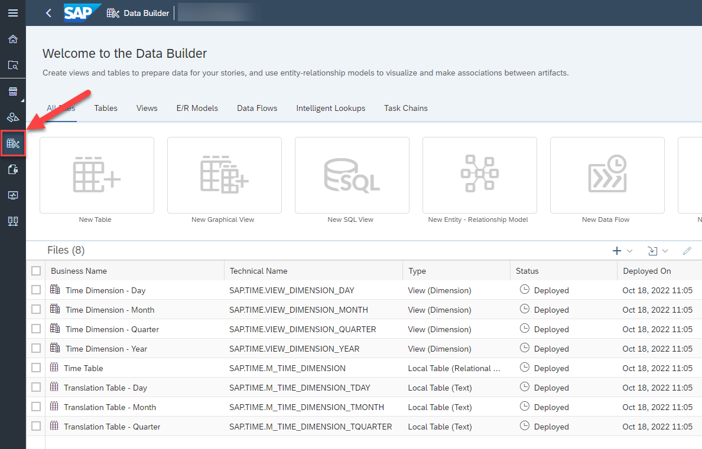

# Exercise 02: Get to know your own Space

> :memo: **Note:** This is part of the <strong>Fast Track</strong> and a mandatory exercise.

---

## :beginner: Detour: SAP Datasphere - Spaces

Spaces as part of the SAP Datasphere solution are virtual team environments where your administrator has the ability to assign users and roles, as well as additional resources, connections to data sources, and allocated storage.  
In SAP Datasphere all data related workflows start with the selection of a Space, so you can see the Space is a fundamental concept.

## End of Detour
 

## Get to know your own Space

---

> :boom: **Important:** :boom:  
> In case you do not use a guided experience trial system for this hands-on training, then you require a space on the SAP Datasphere tenant you are using. 

---

1. In the menu on the left-hand side, select the option ***Space Management***.
 

2. After you selected the menu item, you will be presented with a list of existing Spaces .
 

3. Click the ***EDIT*** button on your assigned space. 
The pre-defined spaces are usually named the same way as your user ID for example GE12345. The technical ID is identical to the space name. 

 

4. You are now being presented with the properties of your Space and you have the ability to configure certain options.  Changing the storage assignment or workload managment options is not possible in guided experience trial systems. 

5. In the members section you can see that your user (e.g. GE12345) is already assigned to the Space.
 

6. In the **Time Data** section click on ***+ Create time Tables and Dimensions*** to create the time dimension in your space.
 

7. For the From Year enter ***2019***.
8. For the To Year enter ***2023***.
9. For all other elements leave the default values.
10. Click ***Create***.
 
 This will create a set of Date / Time Tables which we will use as part of our model to create a date hierarchy
(Year, Quarter, Month, Day).

11. The changes in the **Time Data** section will be deployed immediately. There is no need to save or deploy this change in your space. 
 

12. You can check that the generated time tables and views are avaialble in the **Data Builder** of your space. Use the Data Builder icon in the main menu to the left and you should see 
    - 4 Views of type *Dimension*
    - 3 local tables of type *Text*
    - 1 local table of type *Relational Dataset*

 

## Summary

You just created the time data dimension in your Space in SAP Datasphere. You can now start your next step and
create your first table and data model.

Continue to - [Exercise 03: Prepare Your Data (optional) ](../ex03/README.md)
