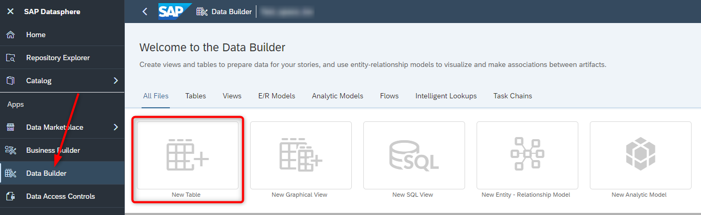
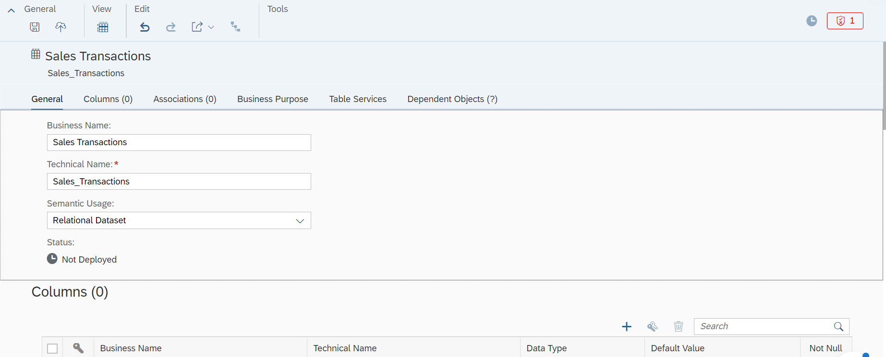
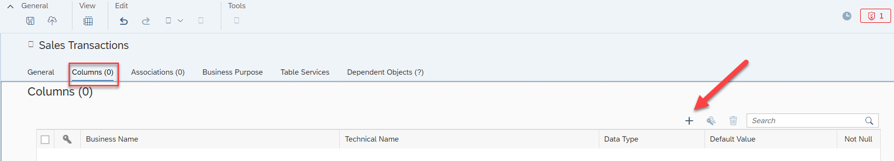
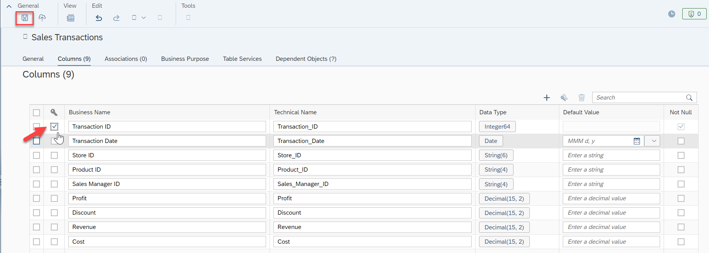
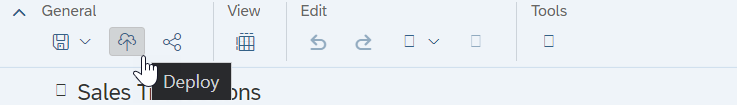
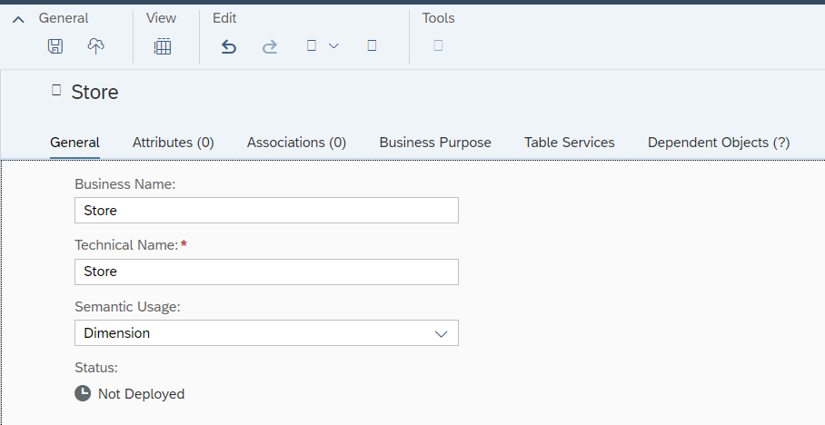
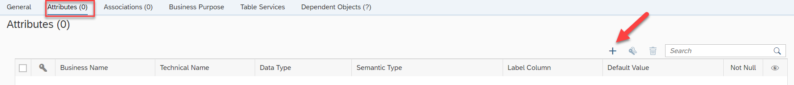
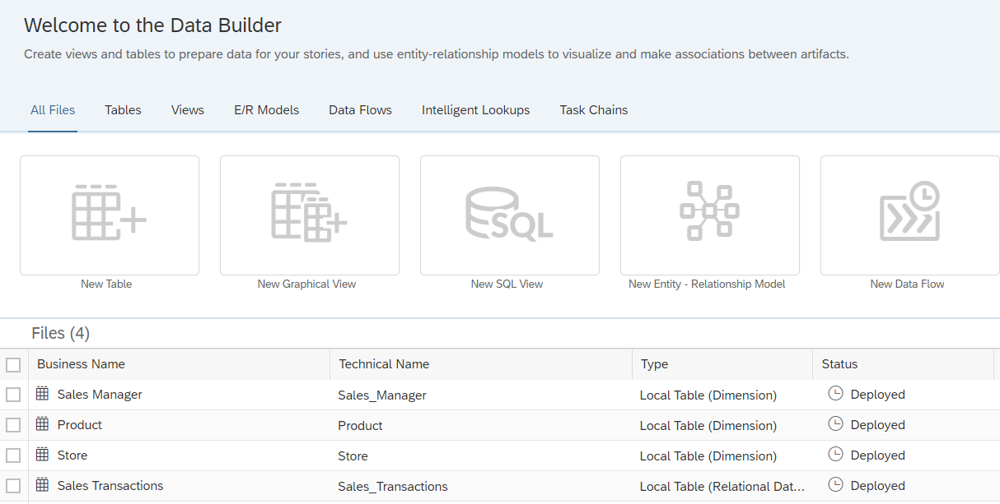

# Exercise 03 - Data Layer - Prepare Your Data

> :memo: **Note:** This is an Optional Exercise

## :beginner: Detour: SAP Datasphere - Model Types
Before we are going to start with the first exercise in creating a table and creating the first model, let us have a look at the
different asset types that you can create in the Data Builder of SAP Datasphere.

So, let’s now look at the different asset types:
- **Table**: Create a table to contain data by defining its column structure. You can configure each field of the table, and already define semantics and associations. You have the ability to upload data to this table later on.

- **Graphical View**: In the Graphical View you can leverage Tables and Views to prepare data and the create new Views using a graphical no-code/low-code editor. Join datasets as appropriate, add other operators to remove or create columns and filter or aggregate data, and specify measures and other aspects of your output structure in the output node. 

- **SQL View**: In the SQL View you can leverage Tables and Views to the create new Views by using SQL or SQL-script (table function) view in a powerful SQL editor.
 *Not used in the DA183 exercises.* 

- **Entity Relationship Model**: Here you define the relationships between Tables or Views, which then are being leveraged when you create a new View based on the Tables or Views.

- **Analytic Model**: Analytic models are the analytical foundation for making data ready for consumption in SAP Analytics Cloud. They allow you to create and define multi-dimensional models to provide data for analytical purposes to answer different business questions. 

- **Data Flow**: You define Data Flows to use data transformations and leverage the option to load data from a source system and persist it in SAP Datasphere.  *Not used in the DA183 exercises.*

- **Replication Flow**: Create a replication flow if you want to copy multiple data assets from the same source to the same target in a fast and easy way and do not require complex projections.  *Not used in the DA183 exercises.*

- **Transformation  Flow**: Create a transformation flow if you want to load data from one or more source tables, apply transformations (such as a join), and output the result in a target table. You can load full or delta data sets of data from one or more source tables to a target table.  *Not used in the DA183 exercises.*

- **Intelligent Lookup**: Create an intelligent lookup to merge data from two entities even if there are problems joining them.  *Not used in the DA183 exercises.*

- **Task Chain**: Create a task chain that groups multiple tasks, which can be run in series manually or through a schedule.  *Not used in the DA183 exercises.*

## End of Detour

## Start of the exercise

In this section we will start creating the tables for our sample models and then upload the raw data to those tables in [Exercise 5](../ex05/README.md). 

We will start to create the tables in SAP Datasphere.

1. Log On to your SAP Datasphere tenant.

2. Select the menu option Data Builder on the left-hand side.

3. In case you are being asked, select your Space (e.g. GE12345) 

4. Select the option New Table

 

5. You are being presented with the details to create a new table.

6. Enter the following details: <ul><li>Business Name - Sales Transactions</li><li>Technical Name - Sales_Transactions</li><li>Semantic Type - Relational Dataset

   
  
7. Scroll down to the area Columns (you can also use the tabs in the page header for navigation). Here you
define now the structure of the table by adding the individual columns.

8. Use the “+” sign in the top right corner of the Columns area to start the process of creating your first table
column
 

9. You now need to enter a Business Name, a Technical Name, and you need to configure the Data Type
10. For the first column, enter the following details: <ul><li>Business Name -   Transaction ID</li><li>Technical Name -   Transaction_ID</li><li>Data Type -  Integer64 
  
---  

> :bulb: **Tip:** Please note, that you can change the <strong>Data Type</strong> simply by clicking on the item in the Data Type column.

---  
  
11. After you entered the details for the first column, please enter additional columns. All columns of the table are listed as follows:
  
| Key: | Business Name:      | Technical Name:                       | Data Type:          |
|:-----|:--------------------|:--------------------------------------|:--------------------|
| X    | Transaction ID      | Transaction_ID                        | Integer64           |
|      | Transaction Date    | Transaction_Date                      | Date                | 
|      | Store ID            | Store_ID                              | String (6)          | 
|      | Product ID          | Product_ID                            | String (4)          | 
|      | Sales Manager ID    | Sales_Manager_ID                      | String (4)          | 
|      | Profit              | Profit                                | Decimal(15,2)       | 
|      | Discount            | Discount                              | Decimal(15,2)       | 
|      | Revenue             | Revenue                               | Decimal(15,2)       | 
|      | Cost                | Cost                                  | Decimal(15,2)       |   
  
12. After you entered all columns for the table, ensure you enable the Key Column option for the column
Transaction ID.
  
13. Now use the Save option in the General menu.
  
  
14. On the first time you save the table, you will be asked to confirm the name and technical name.
15. Click ***Save***.
16. After you saved the changes, you also have to deploy the table, so that we can later on upload data to the table.
17. Use the Deploy option from the General menu  
    
  
18. We configured, saved, and deployed our first table.
19. Click on ***"back arrow"*** on the top menu bar to navigate back to the list of tables. 
   

20. You are back at the home screen of the Data Builder and you should see your table in the list of objects.
21. Use the option New Table.
22. Enter the following details: <ul><li>Business Name - Store</li><li>Technical Name - Store</li><li>Semantic Type - Dimension 
 
 
  
23. Navigate to the Attributes area.
 
24. Use the “+ sign to create new attributes.
  
  
---  
 
> :bulb:  **Tip:** You will notice, based on the Type Dimension, we now have two additional options for each Column:
Semantic Type and Label Column.   
The Label Column allows you to specify a column from the table to be used as Label. For example, you
could have a Product ID and a Product Description in the table and use the Product Description column as
Label for the Product ID.   
The Semantic Type option provides you with several option to choose from, so that you can configure an
additional context for the column, such as the option to configure the column as a Currency column or a
language column.

---
  
25. Enter the following Attributes for the table:  
  
| Key: | Business Name:      | Technical Name:                       | Data Type:          | Semantic Type       | Label Column   |
|:-----|:--------------------|:--------------------------------------|:--------------------|:--------------------|:---------------|
| X    | Store ID            | Store_ID                              | String (6)          | None                | Store_Name     |
|      | Store Name          | Store_Name                            | String (30)         | Text                |
|      | Store City          | Store_City                            | String (20)         | 
|      | State ID            | State_ID                              | String (2)          | 
|      | State Name          | State_Name                            | String(30)          | 
|      | Country             | Country                               | String(30)          | 
|      | Latitude            | Latitude                              | Decimal(15,8)       | 
|      | Longitude           | Longitude                             | Decimal(15,8)       | 
    
---
  
> :bulb: **Tip:** Please note, that you can only select the Store Name for the <strong>Label Column</strong> after you entered the details for
the Store Name into the Attributes.

---

26. After you entered all columns for the table, ensure you enable the Key Column option for the column Store ID.
27. Click ***Save*** in the General menu.
28. You will be asked to confirm the Business Name as well as the Technical Name.
29. Click ***Save***.
30. Click ***Deploy*** in the General Menu.
31. Click on ***"back arrow"*** on the top menu bar to navigate back to the list of tables. 
   

32. Use the option New Table.
33. Enter the following details: <ul><li>Business Name - Product</li><li>Technical Name - Product</li><li>Semantic Type - Dimension 
   
  
34. Navigate to the Attributes for the table.
35. Enter the following Attributes for the table:
 
| Key: | Business Name:        | Technical Name:                       | Data Type:          | Semantic Type       | Label Column          |
|:-----|:----------------------|:--------------------------------------|:--------------------|:--------------------|:----------------------|
| X    | Product ID            | Product_ID                            | String (4)          | None                | Product Name          |
|      | Product Name          | Product_Name                          | String (30)         | Text                |                       |
|      | Product Category ID   | Product_Category_ID                   | String (4)          | None                | Product Category Name |
|      | Product Category Name | Product_Category_Name                 | String (30)         | Text                |                       |  
  
36. After you entered all columns for the table, ensure you enable the Key Column option for the column Product ID.
37. Click ***Save*** in the General menu.
38. You will be asked to confirm the Business Name as well as the Technical Name.
39. Click ***Save***.
40. Click ***Deploy*** in the General Menu.
41. Click on ***"back arrow"*** on the top menu bar to navigate back to the list of tables. 
 

42. Use the option New Table.
43. Enter the following details: <ul><li>Business Name - Sales Manager</li><li>Technical Name - Sales_Manager</li><li>Semantic Type - Dimension 
   
44. Navigate to the Attributes for the table. 
45. Enter the following Attributes for the table:

| Key: | Business Name:        | Technical Name:                       | Data Type:          | Semantic Type       | Label Column          |
|:-----|:----------------------|:--------------------------------------|:--------------------|:--------------------|:----------------------|
| X    | Sales Manager ID      | Sales_Manager_ID                      | String (4)          | None                | Sales Manager Name    |
|      | Sales Manager Name    | Sales_Manager_Name                    | String (30)         | Text                |                       |

46. After you entered all columns for the table, ensure you enable the Key Column option for the column Sales
Manager ID.
47. Click ***Save*** in the General menu.
48. You will be asked to confirm the Business Name as well as the Technical Name.
49. Click ***Save***.
50. Click ***Deploy*** in the General Menu.
51. Use the Back option in top menu or as alternative you can click on your Space name to navigate back to the home screen of the Data Builder.
  
## Summary

You've now created all tables that we need for our model and the overview in the Data Builder should look
like this:
 

Continue to [Exercise 04 - Creating the Entity Relationship Model ](../ex04/README.md)
