# Exercise 04 - Creating the Entity Relationship Model

>:memo: **Note:** This is an Optional Exercise

## :beginner: Detour: SAP Datasphere - Entity Relationship Model

Let us clarify what an Entity Relationship model is and why we are creating it, before we start the exercise.

An Entity Relationship Model provides a variety of benefits:
- Definition of entity-relationship models

- Design physical or remote database models

- Re-use existing entities (table, view) from Data Builder

- Add new entities on-the-fly

- In-editor real time data preview

- Model Import / Export

Basically, the Entity Relationship Model is not a view that you would consume in SAP Analytics Cloud, but instead it represents the relationship between the tables or views, and it helps you to define the relationship once, so that when you create a new view, that you do not have to define those relationships each time.

## End of Detour

## Create the new Entity Relationship Model

1. Log On to your SAP Datasphere tenant.
2. Select the menu option Data Builder on the left-hand side
3. Select the option New Entity - Relationship Model.
 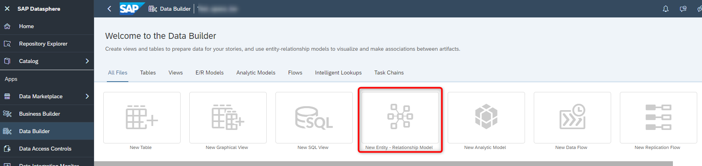 

4. On the left-hand side you are presented with the local Tables and Views from your Repository and you also
have the option to bring in Tables from any remote Sources that you have configured.
5. Ensure to select the option Repository, so that we see the local Tables.
6. Open the list of Tables.
7. Here you should see the tables that we created previously.
 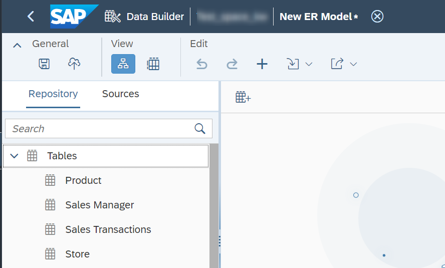   
  
8. Now drag and drop the table Sales Transactions to the canvas.
 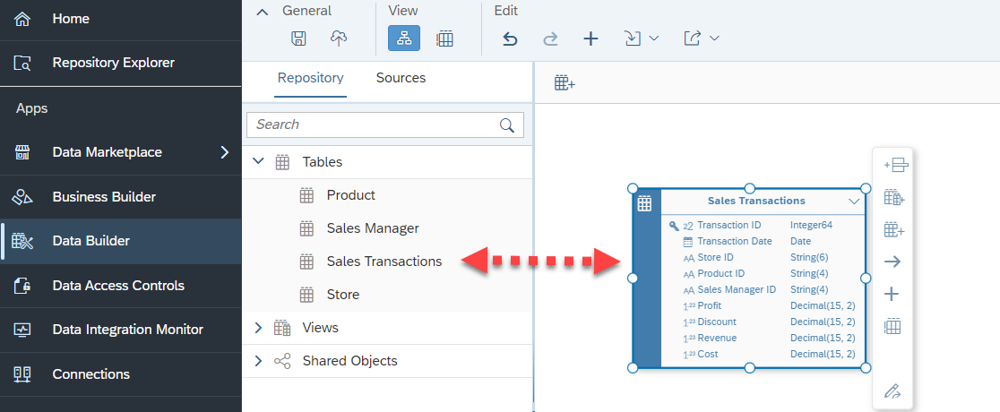 

9. When you select the Sales Transactions table on the canvas, you are presented with additional options, that
allow you to add a new column, create a new View, create a new table, create a join, open the table in the
editor, and to preview the data.
10. Now drag and drop the table Store to the canvas next to the table Sales Transactions.
11. Select the table ***Sales Transaction***.
12. Click on the ***"->"*** symbol to Create a new Association.
 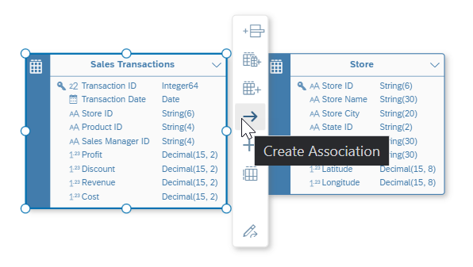

13. Click on the ***arrow symbol*** and drag the icon over to the table Store. You are creating a new Association
between the table Sales Transactions and the table Store.
 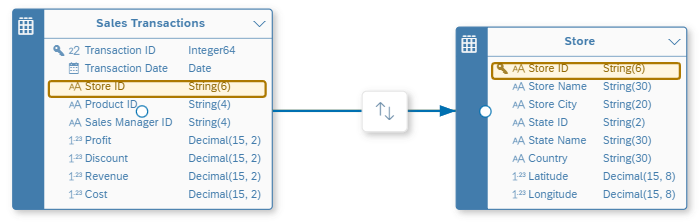 

14. In the Properties panel on the right-hand side click on the ***Expand*** icon.
 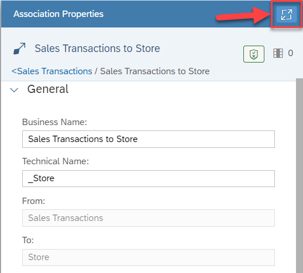 

15. Ensure that the join between the table Sales Transactions and Store is based on column Store ID
(STORE_ID). The system suggests this based on matching columns, but you can also add / remove these
joins manually
 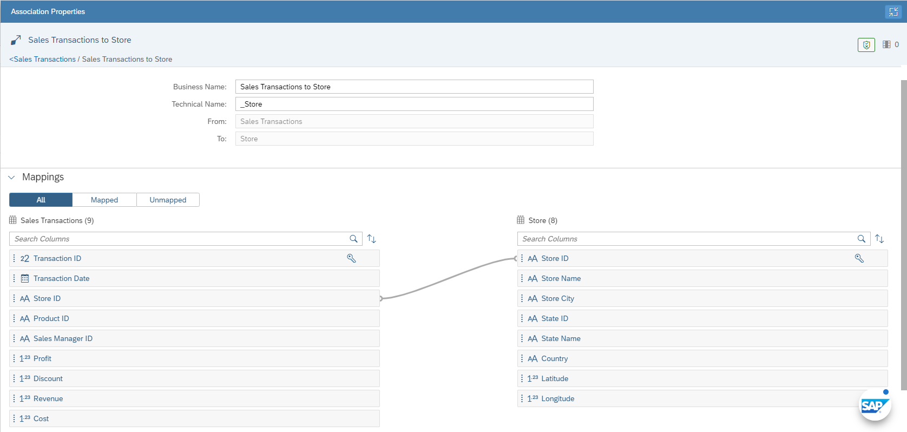 

16. Click on the ***Expand*** icon in the top right corner again to reduce the size of the panel.
17. Now drag the table Product onto the canvas.
18. Select the table ***Sales Transactions*** on the canvas.
19. Select the ***arrow symbol*** and drag and drop the arrow to table Products to create a new Association between the table Sales Transactions and table Product.
 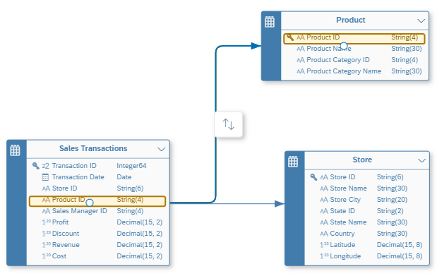 

20. Ensure that the join between the Sales Transactions table and table Product is based on the Product ID (Product ID) column.
21. Now drag the table Sales Manager onto the canvas.
22. Create a new Association between table Sales Transactions and table Sales Manager.
23. Ensure that the join between the Sales Transactions table and the Sales Manager table is based on the Sales Manager ID (Sales Manager ID) column.
24. On the left hand side in the Repository panel, open the list of Views
 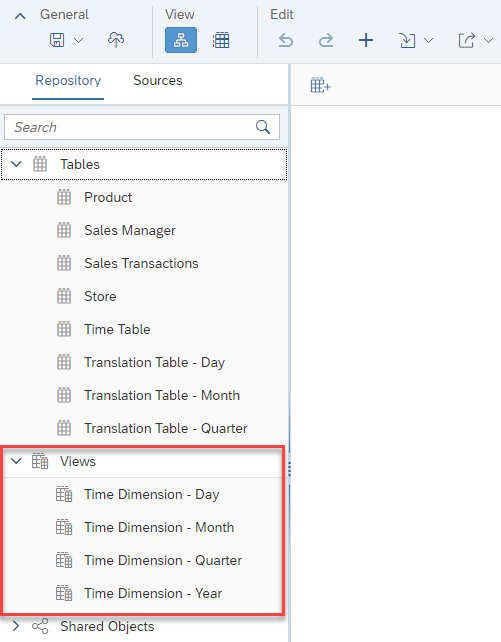 

25. Now drag the View Time Dimension – Day to the canvas.
26. Select the table ***Sales Transactions*** on the canvas.
27. Select the ***arrow symbol*** and drag and drop the arrow to the view Time Dimension - Day to create a new Association between the table Sales Transactions and the view Time Dimension - Day.
28. In the panel on the right-hand side now, create a join between the Transaction Date column and the Date column.
 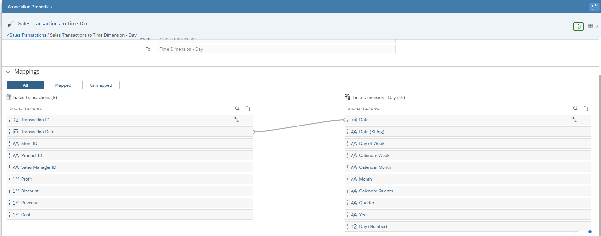 

29. You can use the option to arrange all tables in the toolbar.
 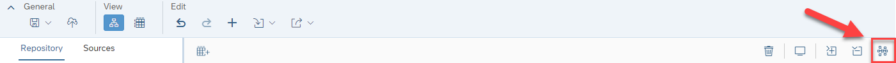 

30. Your Entity Relationship Model should look like the image shown below
 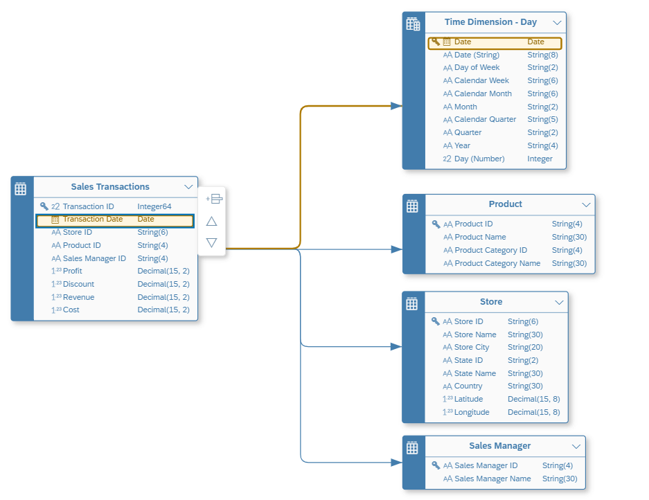 

31. Save the changes to your Entity Relationship model by using the Save option in the General menu.
32. Enter the following details: <ul><li>Business Name - My First Entity Model</li><li>Technical Name - My_First_Entity_Model 
 

33. Click ***Save***.
34. Deploy the model.

## Summary

You've now created the Entity Relationship Model and will make use of it in the next steps when we create the Views.

Continue to - [Exercise 05: Importing Tables (part of <strong>Fast Track</strong> and a mandatory exercise)](../ex05/README.md)
