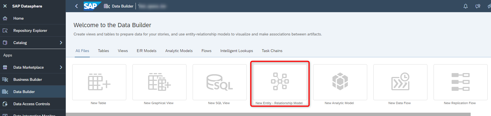
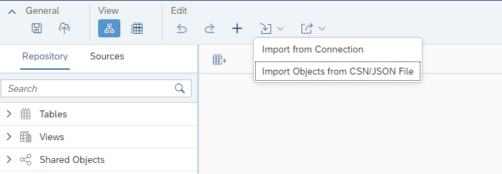
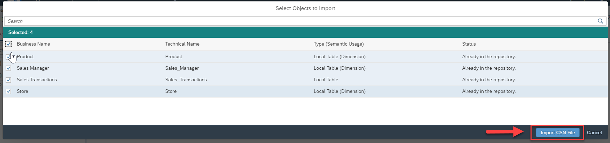
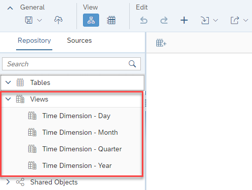
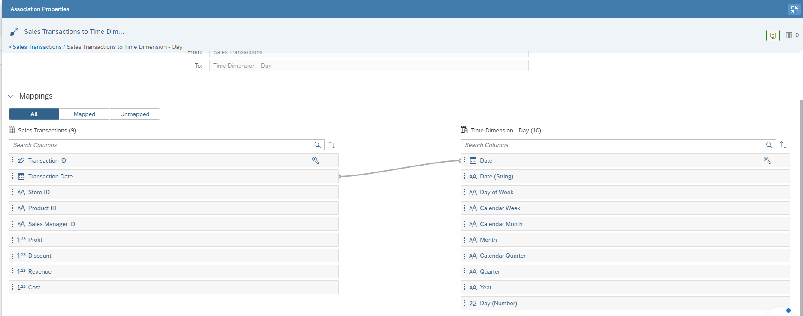
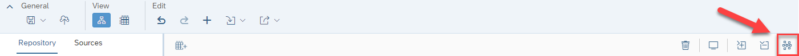
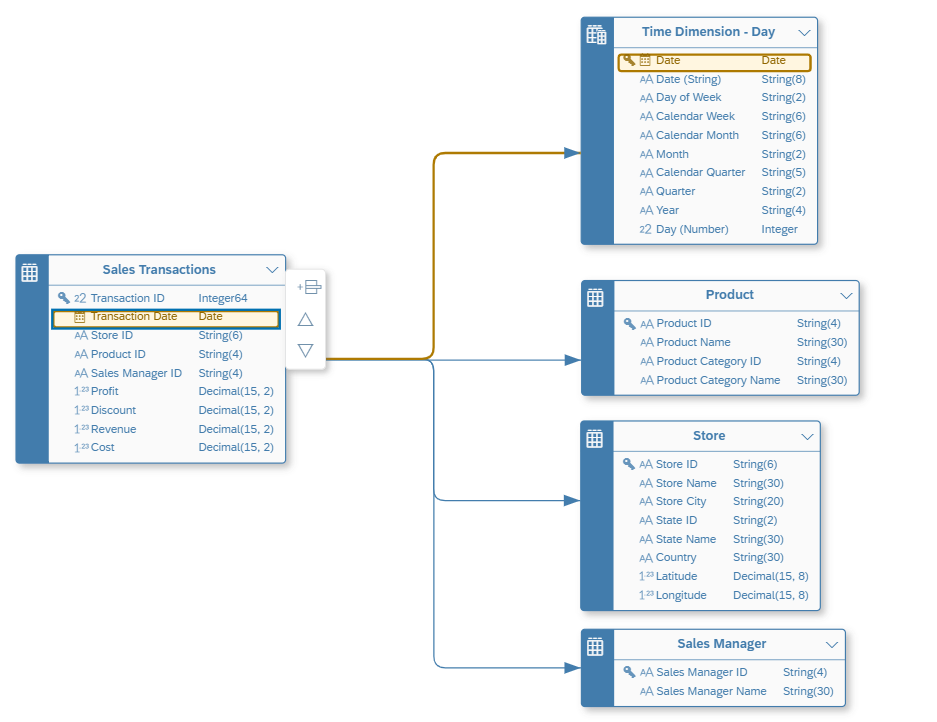

# Exercise 05 - Importing Tables

> :memo: **Note:** This is part of the <strong>Fast Track</strong> and a mandatory exercise.

---

> :boom: **Important:** :boom:  
This exercise is only required in case you ***did not*** create the tables in [Exercise 03 - Prepare Your Data (optional) ](../ex03/README.md) and the Entity Relationship Model for our sample model manually in [Exercise 04 - Creating the Entity Relationship Model (optional) ](../ex04/README.md) and prefer to import them.

---

The file for this exercise is ***“Sales_ER_Model.json”*** and the file is part of the ZIP file you downloaded.

We will now import the table definitions in form of JSON file by importing a Entity Relationship Model.
1. Log On to your SAP Datasphere tenant.
2. Select the menu option Data Builder on the left-hand side.
3. Select the option New Entity – Relationship Model.
  

4. In the New Entity Relationship Model, navigate to the toolbar.

5. Navigate to the Edit menu.
  

6. Open the Import option.
7. Select the option Import from ***CSN File***.
8. Select the file ***“Sales_ER_Model.json”***
9. Click ***Next***.
10. Select all tables.
11. Click Import CSN File.

  

12. You will receive a message about the import being completed and the tables will be shown on the canvas in form of the imported Entity Relationship Model.

13. Save the changes to your Entity Relationship model using the Save option in the General menu.

14. Enter the following details: <ul><li>Business Name - Sales Model - Entity Relationship Model</li><li>Technical Name - Sales_ER_Model
   
  
15. Click ***Save***.

16. On the left hand side in the Repository panel, open the list of Views
  

17. Now drag the View Time Dimension – Day to the canvas.
18. Select the table ***Sales Transactions*** on the canvas.
19. Select the arrow and drag and drop the arrow to the view Time Dimension - Day to create a new Association between the table Sales Transactions and the view Time Dimension - Day.
20. In the panel on the right-hand side now, create a join between the Transaction Date column and the Date column.
  

21. You can use the option to arrange all tables in the toolbar.
  

22. Your Entity Relationship Model should look like the image shown below
  

23. Save the changes to your Entity Relationship model by using the Save option in the General menu.
24. Deploy the model using the Deploy option in the menu bar.

## Summary

As part of the deployment of the Entity Relationship Model, also the underlying tables are being imported and deployed. When you navigate to the Data Builder screen, you should now see a set of 4 tables (3 dimensions and 1 relational dataset) and 1 Entity Relationship Model.

Continue to - [Exercise 06: Uploading Data (part of <strong>Fast Track</strong> and a mandatory exercise)](../ex06/README.md)
