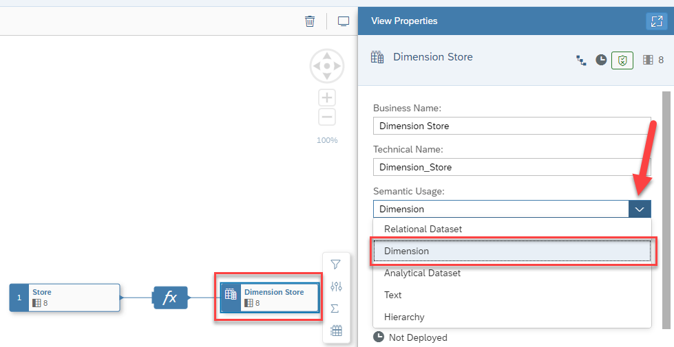

# Exercise 07 - Creating the Dimension 

>:memo: **Note:** This is part of the <strong>Fast Track</strong> and a mandatory exercise.

---

In this exercise, we will create the new Dimension View based on our previously created tables. Part of the steps of defining the dimension will also be to configure the geographic enrichment, so that we can visualize the Store Location on a map later in SAP Analytics Cloud.

1. Log On to your SAP Datasphere tenant.
2. Select the menu option Data Builder on the left-hand side.

3. Click New Graphical View.
  

4. On the left-hand side you can decide between: <ul><li>Repository: Here you have access to the local tables (imported data), Views, Intelligent Lookups and Shared Objects.</li><li>Sources: Here you have access to tables and views from your connections.
 

5. Ensure you select the option Repository.
  
 
  
6. Open the list of Tables.

7. You are presented with the list of tables, which we created previously.
   
 
8. Drag and Drop the table Store to the canvas.
  

9. You automatically will – in addition to the table you dragged to the canvas – receive the output view as well, in our example called View 1
10. Navigate to the Properties window.
  

11. Here you can configure Properties for the final output of this view: <ul><li> You can configure the Business Name as well as the Technical Name.</li><li> You can configure the Type of Dataset.</li><li> You can decide if the View can be consumed or not.</li><li> You can choose which of the available Columns are shown or will be hidden.</li><li> You can define additional Associations.</li><li> You can provide details on the Business Purpose, which then will be available as part of the Business Catalog.
 

12. Enter 
 <ul><li> Dimension Store as Business Name.
 

13. The Technical Name will be generated based on the Business Name, but you can also change it.
14. Set the Semantic Usage to Dimension option.
  
 
15. Enable the option Expose for Consumption.
    
 
16. Now click on the table ***Store*** on the canvas.
  

17. When you select the table on the canvas, you have the following options (top to bottom) <ul><li> You can add Filter on top of the Table.</li><li> You can Rename or Hide columns as part of a Projection.</li><li> You can add Calculated Columns.</li><li> You can add an Aggregation View.</li><li> You can add additional tables / views based on suggested joins, which are based on your Entity
Relationship model.</li><li> You can open the table in the editor.</li><li> You can preview the data.
 

18. Use the option to add a new calculated column. This option also includes the ability to configure the geographic enrichment.
  
 
19. Now click on the new entry “fx” on the canvas.
  

20. Navigate to the properties on the right hand side.
21. Click on the ***“+”*** sign and select the option Geo-Coordinates Column.
  
 
22. You are presented with the properties for the new column
  

23. Configure the following details: <ul><li> Business Name: Store Location</li><li> Technical Name: Store_Location</li><li> Latitude: Latitude</li><li> Longitude: Longitude
 

24. After you configured the details, click on the the “<Columns” option in the properties window to go back.
  

25. Select the final output node for the Dimension View.
26. Navigate to the properties on the right hand side.

27. Navigate to the Attributes area. 
28. Use the pencil icon (top right area) to open the details for the Attributes.
 

29. Ensure the Semantic Type for the line item Store Name is set to Text.
30. Set the Label Column for the line item Store ID to be the Store Name.
31. Click ***Close***.
  
 
32. In the toolbar in the General menu, use the option to Save your changes.
33. After saving your dimension View, ensure you deploy the view.
  
34. In the menu on the left hand side, click on the Home icon.

## Summary

You've now created your dimension view ***Dimension Store*** including the added geo-coordinates column ***Store location***, which is required to use visualizations on maps within SAP Analytics Cloud.

Continue to - [Exercise 08: Creating the View (part of <strong>Fast Track</strong> and a mandatory exercise)](../ex08/README.md)

