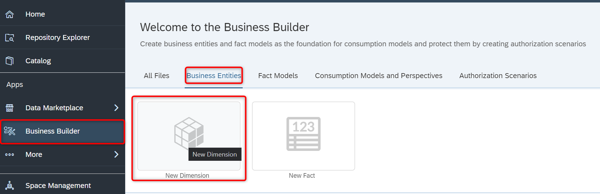
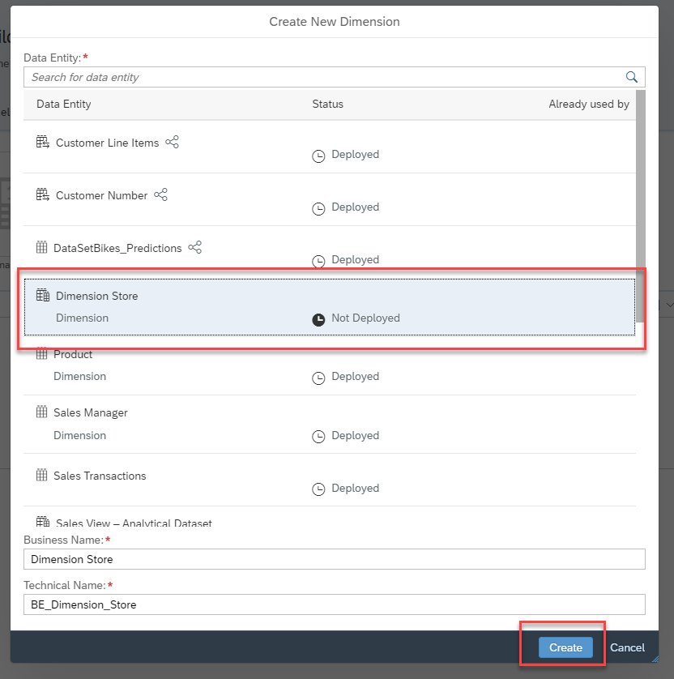
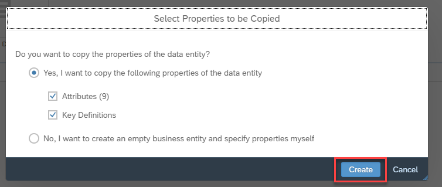
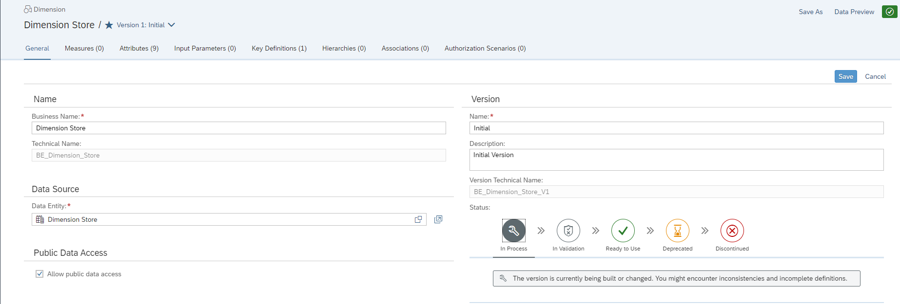
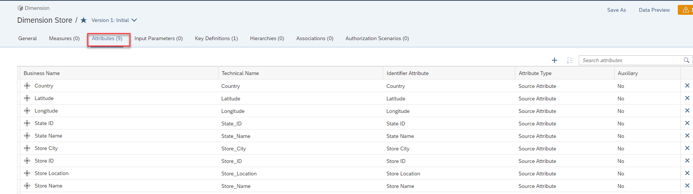
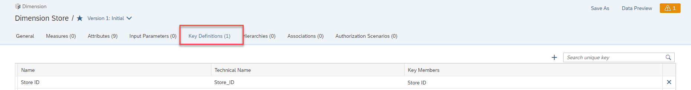
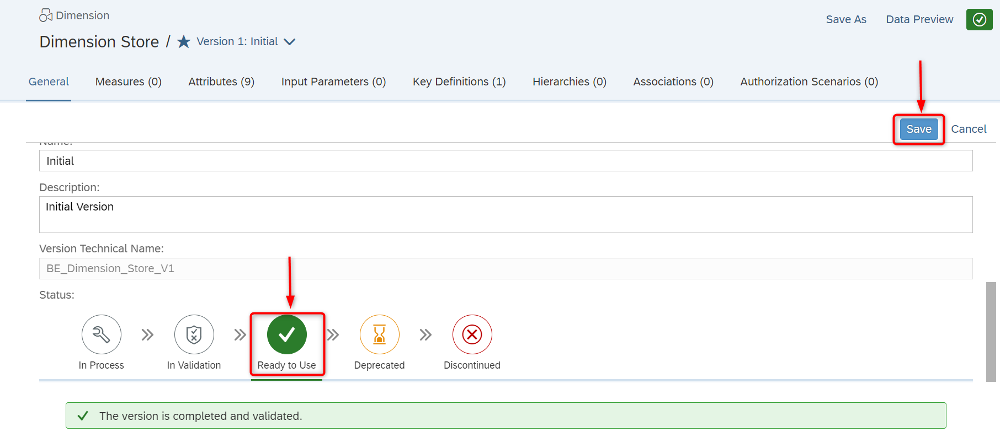

# Exercise 09 - Business Layer - Dimension 

> :memo: **Note:** This is a <strong>Mandatory</strong>  Exercise

---

In this exercise, we will first setup the business entities and then create the consumption model, which
then will be used by SAP Analytics Cloud for our story.

1. Log On to your SAP Datasphere tenant.
2. Select the menu option Business Builder on the left-hand side.
3. In case you are being asked, select the Space you created previously.
4. Select the option Business Entities.
5. Select the option New Dimensions.
  

6. Select the entry for the Store dimension. Ensure to use the Dimension Store View and not the local table
Store.
7. Business Name and Technical Name will be suggested.
8. Click ***Create***
  

9. You are then being asked, if you would like to leverage the existing Attributes and Key Definitions.
  

10. Ensure the option ***“Yes”*** is enabled.
11. Ensure the option ***Attributes*** is enabled.
12. Ensure the option ***Key Definitions*** is enabled.
13. Click ***Create***.
  

14. Ensure the Business Name is set to ***Dimension Store***.
15. Ensure the option Allow public data access is enabled.
 

16. Navigate to the tab Attributes.
17. You should see the following Attributes, which have been leveraged from our previous definition of the
dimension Store
  

18. Navigate to the tab Key Definitions.
19. You should see the Store ID being listed as Key Definition.
  

20. Navigate back to the tab General.
21. Set the Status to Ready to Use.
22. Click Save (top right).
  

---
> :boom: ***Important*** :boom:   
> 23. You can now continue and repeat the steps 5-22 for the other associations: - Product - Sales Manager - Time Dimension – Day (View)  

---

## Summary

You've now created reusable Business Builder Entities based on your data structures in the Data Builder.

Continue to - [Exercise 10: Business Layer – Fact ](../ex10/README.md)
