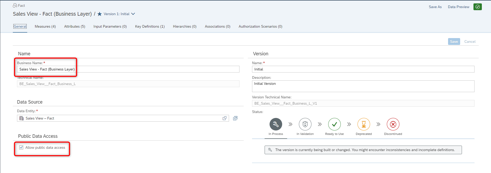

# Exercise 10 - Business Layer – Fact 

> :memo: **Note:** This is a <strong>Mandatory</strong>  Exercise

---

In this exercise, we will now create the Fact entity as part of our Business Layer
and then associate the dimension with the data set.

1. Select the menu option Business Builder on the left-hand side.
2. In case you are being asked, select the Space you created previously.
3. Select the option Business Entities.
4. Select the option New Fact entity.
  

5. Select the entry Sales View - Fact that we created previously.
6. For the Business Name enter - Sales View - Fact (Business Layer)
7. The Technical Name will be suggested.
8. Click Create
  

9. When being asked, select the option “Yes, I want to copy the following properties of the data entity”
10. Ensure the options for Measures, Attributes, and Key Definitions are enabled.
11. Click Create.
  

12. Ensure the Business Name is set to Sales View - Fact (Business Layer).
13. Ensure the option Allow public data access is enabled.
  

14. Navigate to the tab Measures.
15. You should see all previously configured measures based on the definition from our Fact entity.
  

16. Navigate to the tab Attributes.
17. You should see the complete list of Attributes we defined previously in the Fact entity.
  

18. Navigate to the tab Key Definitions.
19. Click on the entry that is listed as Key Definition.
20. You should see the Transaction ID being listed as Key.
  

21. Navigate to the tab Associations.
22. Click the “+” sign in the top right to add a new Association.
  

23. Open the list of Target Business Entities
  

24. Select the entry Dimension Store.
25. Click Apply.
  

26. In the area Target Key Mapping, open the list of fields for the Foreign Key Field.
27. Select the column Store ID from your Fact entity.
  

28. Enter the Context Name ***Store Dimension***
  

29. Click Save (top right).

---

> :boom: ***Important*** :boom:   
> 30. You can now0 continue and repeat the steps 22-29 for the other associations: - Product (For the Foreign Key Field, select Product ID) - Sales Manager (For the Foreign Key Field, select Sales Manager ID) - Time Dimension – Day (Business Layer) (For the Foreign Key Field, select Transaction Date)  

---

31. Navigate back to the tab General.
32. Set the Status to Ready to Use.
33. Click Save.

## Summary

You've now have created your ***Fact*** entity with all the prerequisites to create the consumption model. 

Continue to - [Exercise 11: Business Layer – Consumption Layer ](../ex11/README.md)

