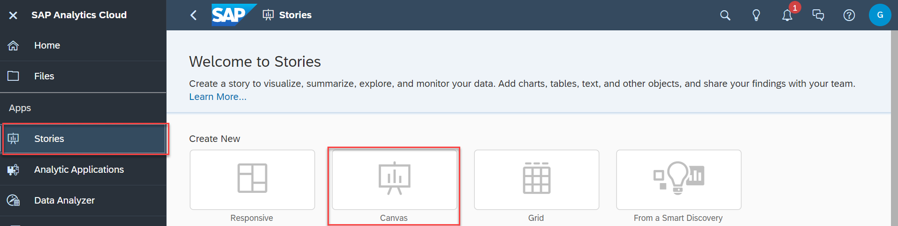

# Exercise 12 - Top 10 Revenue Generating Products

> :memo: **Note:** This is part of the <strong>Fast Track</strong> and a mandatory exercise.

---

In this exercise, we will setup a story in SAP Analytics Cloud, which allows us to view the Top 10 Revenue Generating Products.

1. Log On to your SAP Analytics Cloud tenant.
  
 

---

>:bulb: **Tip:** The system will ask you to resign in.

---

2. Select the menu Stories in the left-hand panel

3. Select the option Canvas to create a new Story.
  

4. Select "Optimized Design Experience" when asked "What design mode would you like to use?". Click "Create".
  

5. Under Widgets, select and drag the "Chart" onto the canvas.
 
6. To select the model that you want to reference in your story <ul><li>select "DATASPHERE" as the connection on the left panel</li><li>select your SPACE e.g. ***GE12345***</li><li>for our first example, select your ***Sales - Analytic Model***</li></ul>
 

7. Now select the newly created empty chart on the canvas.
8. Navigate to the Builder Panel on the right hand side.
  

9. Click Add Dimension as part of the Dimensions section.
  

10. Select Transaction Date & Product ID.
 
>:bulb: Ensure the Transaction Date is positioned first within the Dimensions section.  

11. Click Add Measure as part of the Measures section.
12. Select measure Revenue.
 

13. Click on the Filter icon for dimension Transaction Date.
14. Select the option Filter by Member.
  
15. Open the list of members and select the year 2022.
16. Click OK
 
17. Open the More menu (...) for the chart (top right corner of chart).
18. Within the menu, go to Rank > Top N Options > Update value to "10".
19. Click Apply.
 

20. Update Chart Orientation to ***Horizontal*** in the Builder Panel.
21. You can adjust the sizing of the chart by clicking and dragging the brackets outward or inward.
 

22. Your chart should look like this.
  

23. In the File menu select the option "save" to save your story.
24. Create a User folder that matches your Space name,  e.g. ***GE12345***.
  
25. Enter a Name and Description like ***Top 10 Revenue Generating Products***.
26. Click OK.

## Summary

You've now created your first SAP Anayltics Cloud Story on top of the data model you created earlier. 

Continue to - [Exercise 13: Revenue by Geography (requires Exercise 08 to be completed) ](../ex13/README.md)
