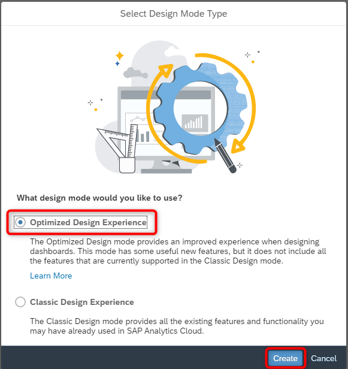

# Exercise 13 - Geographic Revenue Distribution

>:memo: **Note:** This is part of the <strong>Fast Track</strong> and a mandatory exercise.

---

In this exercise, we will we will setup a story in SAP Analytics Cloud, which allows us to view the measures along a
geographic map.

1. Log On to your SAP Analytics Cloud tenant.
  
 

---

>:bulb: **Tip:** The system will ask you to resign in.

---

2. Select the menu Stories in the left-hand panel

3. Select the option Canvas to create a new Story.
  

4. Select "Optimized Design Experience" when asked "What design mode would you like to use?". Click "Create".
  

5. Under "Others", select and drag the "Geo Map" onto the canvas.
 
  
19. Resize the map so that it uses the complete canvas. You can accomplish this by opening the More menu (...) and selecting Fullscreen.
 

21. In the Builder panel on the right hand side, select the option “Add Layer” for the Content Layer option.
  

22. Click on the database icon to choose your data model.
 

23. Click within the Search field and choose "Select other model" option
 

24. To select the model that you want to reference in your story <ul><li>select "DATASPHERE" as the connection on the left panel</li><li>select your SPACE e.g. ***GE12345***</li><li>for our first example, select your ***Sales - Analytic Model***</li></ul>
 

25. In the Builder panel, click on Add Location Dimension for the Location Dimension area
26. Select the option Store Location. This is the store location dimension we created previously based on the
longitude and latitude values for the store dimension.
  

27. Click on Add Measure for the Bubble Size.
28. Select measure Revenue.
  

29. Click Add Measure / Dimension for the Bubble Color
30. Select measure Profit.
  

31. Now open the details for the measure Profit as part of the Bubble Color
32. Open the list of Color Palette.
33. Select the second entry from the Diverging category going from Red to Green.
  

34. Now open the details for the Bubble Size definition.
35. Set the size to 35%.
36. Click Done to save your Layer.
  

37. Your map should look like this.
  

38. In the File menu, select "Save" to save your story.
39. Select the User folder that matches your assigned user number.
40. Enter a Name and Description like ***Geographic Revenue Distribution***.
41. Click OK.
 

## Summary

You've now created your second story based on the SAPDWC connection to your data models in SAP Datasphere. 

Continue to - [Exercise 14: Best Salesperson (requires Exercise 11 to be completed) ](../ex14/README.md)
